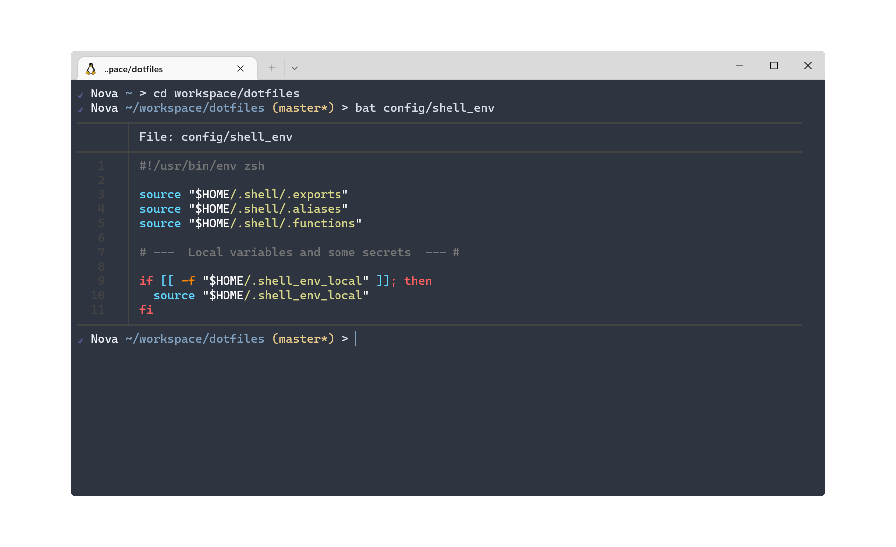

# 🏡 dotfiles

Yet another repo with collection of the personal configs and settings for shell.
Powered by [Dotbot](https://github.com/anishathalye/dotbot) which helps to sync them and create symlinks to the files in the repository.


## Overview

This is a collection of configurations and settings for shell with work purpose. It tends to be minimalistic and clean.




## 📌 Requirements

- `git` - for performing basic Git operations.

- [Zsh](https://www.zsh.org/) - since this repo is used [oh-my-zsh](https://github.com/ohmyzsh/ohmyzsh) to manage configurations.


## 🚀 Quick start

NOTE! Before installation make sure you have backed up copy of your `.zshrc`.

1. Clone this repo to your machine.

```shell
git clone https://github.com/andriyreznik/dotfiles.git
```

1. Change the directory to the cloned repo.

```shell
cd dotfiles
```

1. Run installation script and wait till the dotfiles will be synced and configured.

```shell
./install
```

## ⚖️ License

See [LICENSE](LICENSE).
