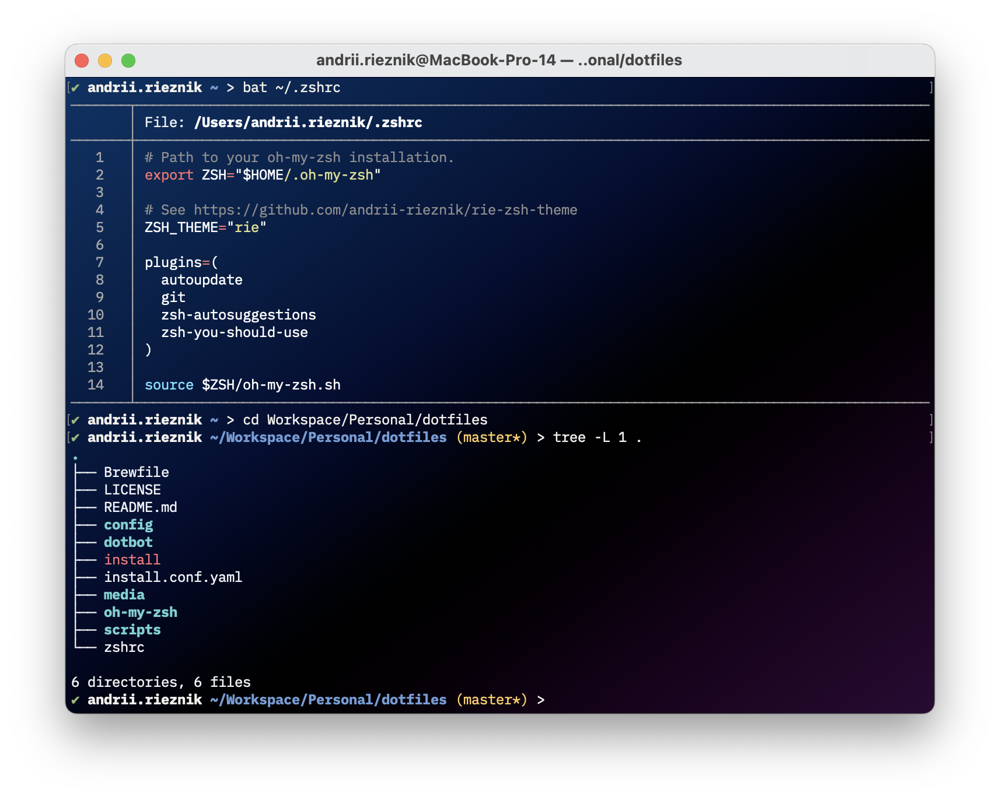

# 🏡 dotfiles


Yet another collection of personal shell configuration files.
Powered by [Dotbot](https://github.com/anishathalye/dotbot).



## ⤵️ What's inside?

- [Brewfile](Brewfile) is used to manage command-line programs and GUI-based macOS apps.

- [Oh My Zsh](https://github.com/ohmyzsh/ohmyzsh) - for managing configurations,

  - Custom [plugins](oh-my-zsh/custom/plugins);

  - Custom [themes](oh-my-zsh/custom/themes);

- Terminal.app [profiles](config/terminal/profiles), which include settings for colors, fonts, and more.

## 📦 Installation

> [!NOTE]
> Before starting, ensure you have a backed-up copy of your `.zshrc`.

1. Clone this repository into any preferred folder:

```shell
git clone git@github.com:andrii-rieznik/dotfiles.git
```

2. Change into the dotfiles subdirectory:

```shell
cd dotfiles
```

3. Run the installation [script](install):

```shell
./install
```
